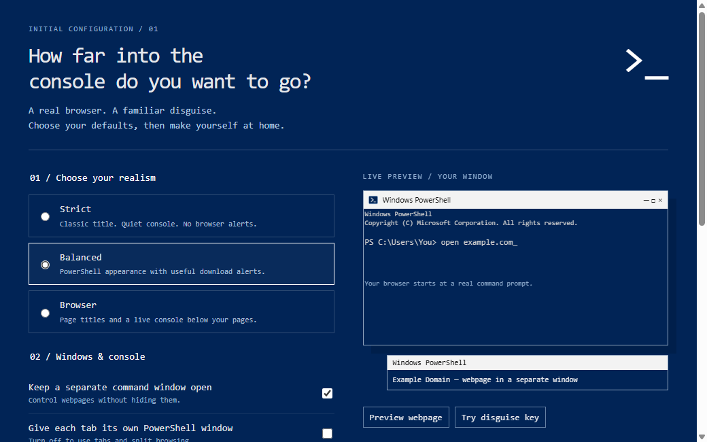

# Larp Browser / PowerShell Browser

A standalone Windows browser that copies classic Windows PowerShell: native Windows frame, PowerShell blue (`#012456`), Consolas, the startup banner, and an underscore cursor. Browser controls live in the command prompt; websites render in Chromium. This is its own browser with its own profile.

## Download and first launch

Download **PowerShell-Browser-Windows.zip** from [Releases](https://github.com/w7llywonka/larp-browser/releases). Extract the entire ZIP and open **PowerShell Browser.exe**. Keep accompanying folders with the executable. No Node.js installation is needed.

First launch plays a short console boot animation, then opens configuration with a live preview. Choose Strict, Balanced, or Browser realism, then customize separate windows, titles, startup text, live output, download alerts, blinking, font size, disguise shortcut, and search engine. Type `setup` to revisit the preview or `settings` for a numbered console menu.



## Separate control window

The default keeps the command prompt open in its own native window. Opening a website opens a separate browser window, so you can enter commands without hiding the webpage. The console controls the selected tab. Clicking a page or using `tab 2` selects it. `tabs` lists pages; `new example.com` adds one; `close` closes the selected tab while preserving the control window.

`tab remove 1 2 3` closes several tabs using their numbers before the command starts. `tab close 1 2 3` and `close 1 2 3` also work. All numbers are checked first, and repeated numbers close a tab only once. Closing a page window's last tab closes that window; the separate control prompt remains open and shows no open tabs instead of creating an empty replacement.

Use `settings console off` for the original single-window behavior. **Ctrl+L** toggles between a webpage and its prompt; Escape from an empty prompt returns to the page. In separate control mode the control prompt stays visible while the page resumes in its own window.

`settings windows on` gives each tab its own native PowerShell window. `settings windows off` puts tabs together again. Live output appears only in the control window when it is separate; webpage windows use their full height. Changing window modes moves existing pages without reloading. Private and regular pages remain in separate sessions.

## Commands

Type an address, search, or command and press Enter. These are browser commands, not actual PowerShell commands.

```text
example.com
open https://www.wikipedia.org
search mechanical keyboards
```

| Command | Action |
| --- | --- |
| `help` | Complete command and shortcut reference |
| `back`, `forward`, `reload`, `stop` | Navigate the selected page |
| `new [address]`, `tabs`, `tab 2`, `close [number]` | Manage tabs |
| `tab remove 1 2 3`, `tab close 1 2 3`, `close 1 2 3` | Close several tabs using the original tab numbers |
| `tab github`, `tab next`, `tab prev` | Select by unique name/URL or cycle |
| `reopen`, `restore` | Reopen a closed tab or saved regular session |
| `split example.com`, `split tab 2` | Two real pages side by side |
| `split focus left`, `split focus right` | Choose which pane commands control |
| `split ratio 60`, `split swap`, `split off` | Adjust split or leave it; pages remain open |
| `workspace save Research` | Save URLs, zoom, audio, and split layout |
| `workspace open Research` | Open a saved group alongside current tabs |
| `workspaces`, `workspace remove Research` | List or remove saved groups |
| `watch on`, `watch off`, `watch` | Live loading/download/find output or recent events |
| `snapshot` | Save a PNG of the selected page's visible viewport |
| `note` or `scratchpad` | Autosaving text editor; Escape returns to prompt |
| `panic` or `disguise` | Hide all pages and clear visible console addresses |
| `settings`, `setup` | Numbered menu or visual configuration preview |
| `settings realism strict` | Choose strict, balanced, or browser preset |
| `settings console on`, `settings windows on` | Separate control window / one window per tab |
| `settings title page`, `settings notifications off` | Page titles / download title and taskbar alerts |
| `settings banner off`, `settings blink off`, `font 18` | Console appearance |
| `settings panic f12` | Choose f8, f12, or ctrlshiftspace |
| `settings search google` | Choose duckduckgo, google, or bing |
| `bookmark [name]`, `bookmarks` | Save or list bookmarks |
| `bookmark open 1`, `bookmark remove 1` | Open or remove a bookmark |
| `history [words]`, `history clear` | Search or clear history |
| `downloads` | Download states and saved paths |
| `download show 1`, `download open 1` | Reveal or open a completed download |
| `download pause 1`, `download resume 1`, `download cancel 1` | Control a download |
| `private`, `window` | New private or regular window |
| `find words`, `find next`, `find prev`, `find clear` | Search a page |
| `zoom 150`, `mute` | Page zoom or audio |
| `save`, `print`, `status`, `site` | Save HTML, print, page state, connection |
| `home`, `cls`, `about`, `exit` | Prompt, clear output, version, close window |

Split browsing needs `settings windows off`. Workspaces are available in regular windows. Numbered settings accept a number to cycle or a number and value (`10 on` enables the command window); `done` leaves the menu.

## Shortcuts

**Ctrl+L** toggles the page prompt. **F8** disguises all windows by default; Ctrl+L restores the selected page. **Ctrl+Shift+S** takes a snapshot. **Ctrl+T/W** opens/closes a tab. **Ctrl+Shift+T** reopens one. **F2** or **Ctrl+Shift+A** lists tabs. **Ctrl+1..8** selects a tab; Ctrl+9 selects the last. **Ctrl+Tab / Ctrl+Shift+Tab** cycles. **Alt+Left/Right** goes back/forward. **F5 / Ctrl+R** reloads. **Ctrl+D/H/J/F** opens bookmark/history/download/find commands. **Ctrl+Shift+N / Ctrl+N** opens a private/regular window. **Ctrl++ / Ctrl+- / Ctrl+0** changes zoom. **Ctrl+S/P** saves/prints; Ctrl+S inside the scratchpad saves notes. **F11** toggles fullscreen. **Up/Down** recalls commands; **Tab/Shift+Tab** cycles completions. Websites have a normal editing/navigation context menu.

## Develop on another device

Install Git and Node.js **22.12 or newer** (24 recommended):

```sh
git clone https://github.com/w7llywonka/larp-browser.git
cd larp-browser
npm ci
npm start
```

Electron development works on supported desktop systems; faithful native framing and the portable release target Windows x64.

```sh
npm test         # Unit tests
npm run verify  # Electron integration checks with an isolated profile
npm run package # Portable app in dist/PowerShell Browser-win32-x64
```

Run the packaged executable with `--smoke-test` for isolated startup/close verification. `BROWSER_OUTPUT` overrides packaging output; `PSB_VERIFY_OUTPUT` overrides test artifacts; `PSB_SMOKE_PROFILE` overrides the smoke profile. GitHub Actions verifies and builds Windows releases on pushes and pull requests. Commit and push changes to share development between devices; local browsing data is not synchronized.

## Profile and draft scope

Regular cookies, history, preferences, tab URLs, workspaces, bookmarks, downloads metadata, and scratchpad text live in `%APPDATA%\PowerShell Browser`. Private sessions use isolated temporary cookies, history, and scratchpad text. Private data stays out of the regular profile. Explicitly saved bookmarks, downloads, and snapshots remain on disk. Closing the last window in a private session clears its storage.

Remote pages are sandboxed without Node.js or the local command bridge. Permissions use native dialogs; certificate failures are not bypassed. Disguise hides the interface; it does not delete history or saved files.

Version **0.3.2** is an independent Electron/Chromium browser prototype. Chrome extensions, account sync, password management, default-browser registration, automatic updates, installers, and DRM support are not included. The native frame follows Windows version/display settings. The startup copyright line reproduces original PowerShell text; this project is not affiliated with Microsoft. Electron/Chromium notices accompany the release.

Validated locally with **8 unit tests, 93 browser integration checks**, and packaged startup/close checks. These cover navigation, popup POST bodies, downloads, private isolation, onboarding, split bounds, snapshots, notes, workspaces, live output, native window migration, persistent console control, disguise, and destruction. Public HTTPS verification is supplementary; local fixtures drive required checks.

